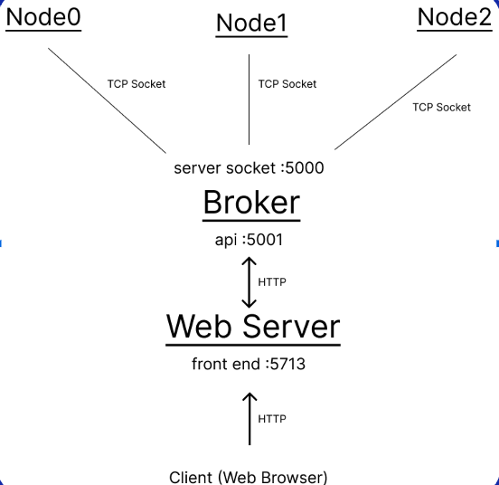
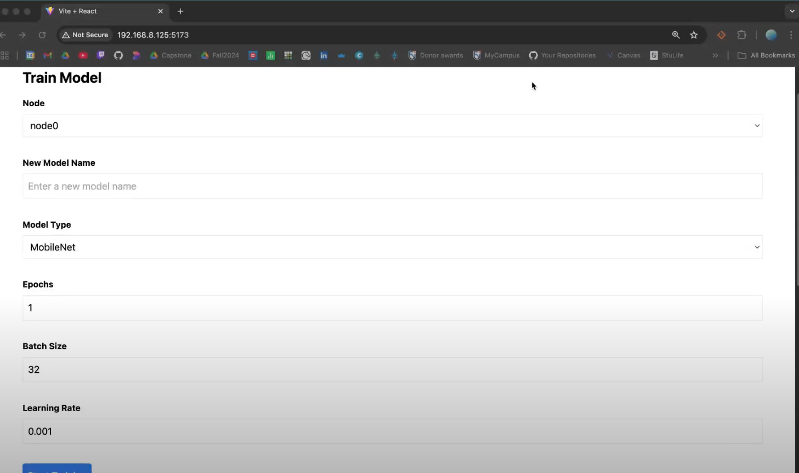
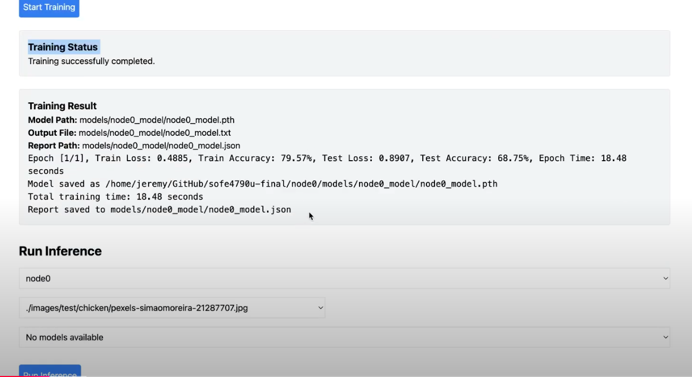
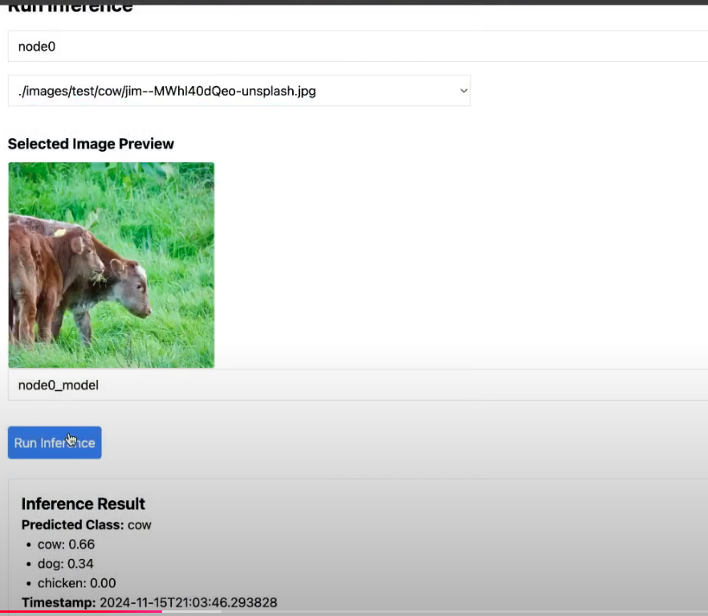
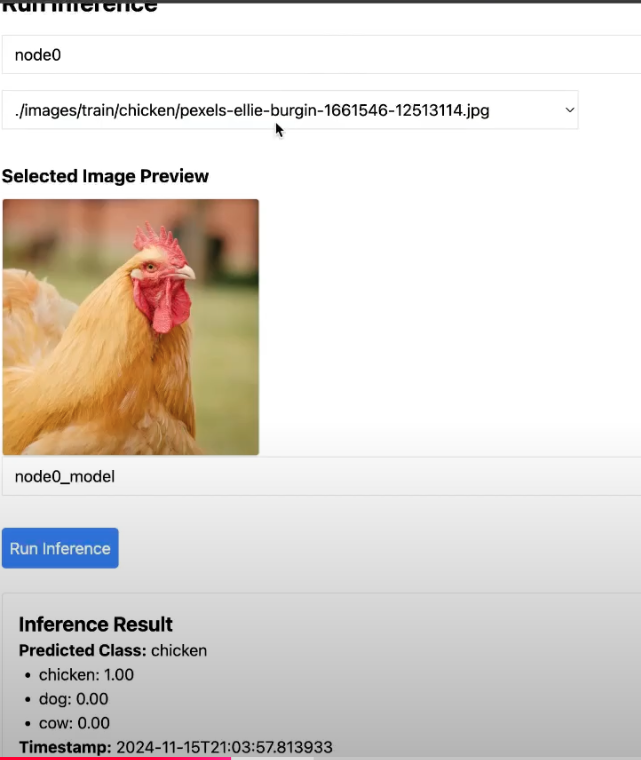
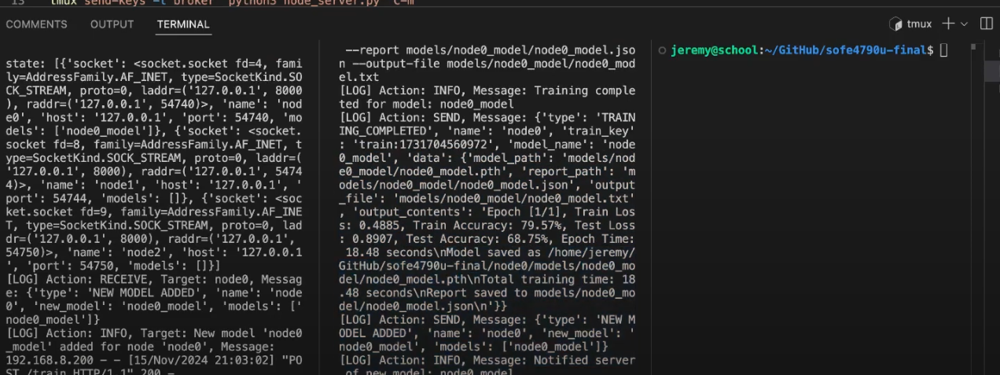
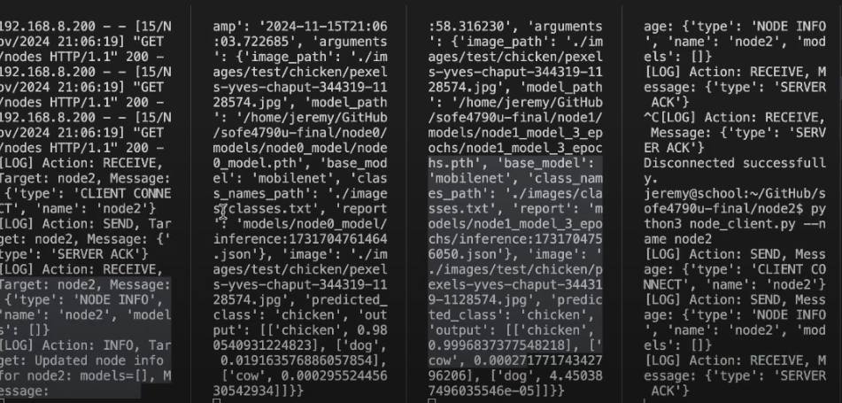

# sofe4790u-final

This is the final project for SOFE 4790U. Conducting Training and Inference on an Image Classification Deep Learning Model in a Distributed Architecture.

## Diagrams

Simple Network Architecture

 

## How To Run It

You can either turn everythnig on if you have tmux using the following:

```bash
git clone https://github.com/JeremyTubongbanua/sofe4790u-final.git
cd sofe4790u-final
./up.sh
```

You could also just run the broker and worker nodes manually via

Run the broker

```bash
cd broker
python3 node_server.py
```

Run 3 nodes

```bash
cd node0
python3 node_server.py
```

```bash
cd node1
python3 node_server.py
```

```bash
cd node2
python3 node_server.py
```

Run the front end

```bash
cd frontend
npm run dev
```

Then connect on `https://localhost:5713` on your browser to see the front end

## Video Demo

<https://www.youtube.com/watch?v=6vejI1CUk0I>

## Screenshots

Model train





Model Inference





Back end with 1 server and 1 worker node



Back end with 1 server and 3 worker nodes



## Protocol Specification

| Message Type          | Description                                                              | Example Request                                                                                                           | Example Response                                                                                                       |
|-----------------------|--------------------------------------------------------------------------|-------------------------------------------------------------------------------------------------------------------------|-----------------------------------------------------------------------------------------------------------------------|
| CLIENT CONNECT        | Sent by the client when it connects to the server to register itself.    | `{"type": "CLIENT CONNECT", "name": "node0"}`                                                                            | `{"type": "SERVER ACK"}`                                                                                              |
| NODE INFO             | Sent by the server to update the client with its current state and list of models. | `{"type": "NODE INFO"}`                                                                                                 | `{"type": "NODE INFO", "name": "node0", "models": ["model1", "model2"]}`                                              |
| CLIENT PING           | Sent by the client to check connectivity with the server.               | `{"type": "CLIENT PING", "name": "node0"}`                                                                               | `{"type": "SERVER PONG"}`                                                                                             |
| CLIENT DISCONNECT     | Sent by the client to notify the server that it is disconnecting.        | `{"type": "CLIENT DISCONNECT", "name": "node0"}`                                                                         | `{"type": "SERVER ACK"}`                                                                                              |
| SERVER TRAIN          | Sent by the server to instruct a node to start training a model.        | `{"type": "SERVER TRAIN", "modelName": "model1", "modelType": "resnet", "epochs": 10, "batchSize": 32, "learningRate": 0.01, "train_key": "train123"}` | Training subprocess starts; no immediate response. Once completed, a message like `{"type": "TRAINING_COMPLETED", "model_name": "model1", "data": {...}}` is sent. |
| TRAINING COMPLETED    | Sent by the client to the server after model training is completed.      | `{"type": "TRAINING COMPLETED", "name": "node0", "train_key": "train123", "model_name": "model1", "data": {"model_path": "models/model1/model1.pth"}}` | No explicit response.                                                                                                |
| SERVER INFERENCE      | Sent by the server to instruct a node to perform inference using a specific model. | `{"type": "SERVER INFERENCE", "image_path": "images/sample.jpg", "model_name": "model1", "inference_key": "inference123"}` | If successful: `{"type": "JSON_RESPONSE", "inference_key": "inference123", "data": {...}}`. If error: `{"type": "ERROR", "message": "Inference report not found"}` |
| JSON_RESPONSE         | Sent by the client to respond with data requested by the server (e.g., inference results, JSON data). | N/A. Triggered by other operations. Example response: `{"type": "JSON_RESPONSE", "inference_key": "inference123", "data": {"prediction": "cat", "confidence": 0.95}}` | No explicit response.                                                                                                |
| GET_JSON              | Sent by the server to request a specific JSON file from the client.      | `{"type": "GET_JSON", "name": "node0", "json_name": "model1"}`                                                           | If found: `{"type": "JSON_RESPONSE", "name": "node0", "json_name": "model1", "data": {...}}`. If not found: `{"type": "ERROR", "name": "node0", "message": "File not found"}` |
| NEW MODEL ADDED       | Sent by the client to notify the server that a new model has been added. | `{"type": "NEW MODEL ADDED", "name": "node0", "new_model": "model2", "models": ["model1", "model2"]}`                    | No explicit response.                                                                                                |
| ERROR                 | Sent by the client or server when an operation fails (e.g., file not found, inference error). | `{"type": "ERROR", "message": "File 'models/model1/model1.json' not found"}`                                             | No explicit response.                                                                                                |
| SERVER ACK            | Sent by the server to acknowledge receipt of a message.                 | Any message requiring acknowledgment. Example response: `{"type": "SERVER ACK"}`                                        | No explicit response.                                                                                                |
| SERVER PONG           | Sent by the server to acknowledge a CLIENT PING message.                | `{"type": "CLIENT PING", "name": "node0"}`                                                                               | `{"type": "SERVER PONG"}`                                                                                             |
| SERVER PING           | Sent by server to ping a specific client.                               | `{"type": "SERVER PING"}`                                                                                                | No explicit response.                                                                                                |
| CLIENT PONG           | Client sends pong to server                                             | `{"type": "CLIENT PONG", "name": "node0"}`                                                                               | `{"type": "SERVER ACK"}`                                                                                              |

## Authors

- [Andy](https://github.com/AndyyLC)
- [Emily](https://github.com/emilyirenelai)
- [Jeremy](https://www.github.com/JeremyTubongbanua)
- [Natasha](https://github.com/natt-n)
